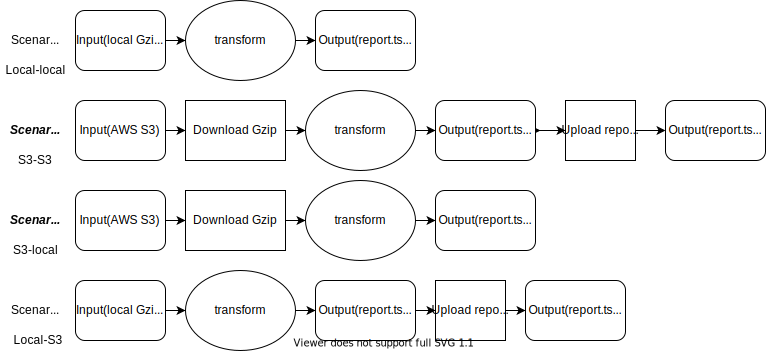

# Daltix Data Inspector(DDI)

It is a CLI tool to analyse JSON files(gzipped) and generate a report over it. The tool helps to group the data and helps to perform aggregate calculations over it \
The generated report is a TSV file with the following columns:
**shop, country, location, resource_type, resource_count, has_name,
has_name_pct, has_brand, has_brand_pct, has_description,
has_description_pct, has_images, has_images_pct, has_price,
has_price_pct, has_promo, has_promo_pct**

## Requirement or Assumption
* AWS credentials(IAM) should be configured beforehand on the machine at which this cli is about to get used.
 
## Architecture
 


## Installation

I used [anaconda](https://www.anaconda.com/products/individual) here as package manager\
Commands for both are written as follows:
```bash
# using Conda
$ conda create --name <env_name> --file requirements.txt
```

## Sample Usage (CLI)

```bash
# Scenario aws to local
$ python daltix_cli.py "s3://daltix-public-interviews/software_engineer_challenge/transformer-output-default-prod-4-2021-03-21-07-42-18-876da73a-4eec-4982-a453-c1876853556f" --input-location-type "aws s3" --report-format "tsv"
```

```bash
# Scenario local to local
$ python daltix_cli.py "software_engineer_challenge/" --input-location-type "local" --report-format "csv"
```

```bash
#Scenario local to aws
$ python daltix_cli.py "software_engineer_challenge/" --input-location-type "local" --report-format "csv" --output-location "s3://daltix-public-interviews" --output-location-type "aws s3"
```

## Checklist
- [x] Support for other cloud providers although extension code is provided
- [x] Support for webhooks
- [x] The tool runs locally (e.g. by a developer on their laptop)
- [x] Report can be generated in tsv or csv format  
- [ ] Works on windows, but lacks cross platform support(need to change little bit code on mac platform)
- [ ] Stress testing although I could generate report over more than 500k lines of code(my computer is a i3 processor :sweat_smile:)
- [ ] Logging is implemented but not completely as I had no idea about Daltix logging infrastructure

## Improvements
* Pandas optimization
* Putting logging mechanism
* Putting proper constraints over CLI input

## Contributing
Pull requests are welcome. For major changes, please open an issue first to discuss what you would like to change.
You can also drop a mail to [Prashant Tyagi](mailto:tyagi.prashant0099@gmail.com)
Please make sure to update tests as appropriate.

## License
[MIT](https://choosealicense.com/licenses/mit/)